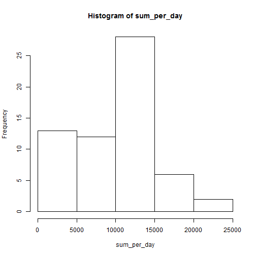
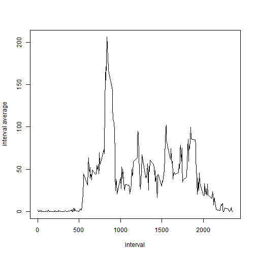
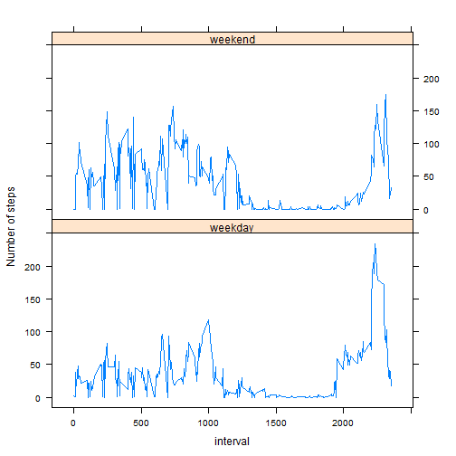

# Reproducible Research: Peer Assessment 1
## Loading and preprocessing the data  
1.Load the data  

```r
data<-read.csv("activity.csv",colClasses=c("numeric","character","character"))
```
## What is mean total number of steps taken per day?  
1.Make a histogram of the total number of steps taken each day  

```r
sum_per_day<-tapply(data$steps,data$date,sum,na.rm=TRUE)
hist(sum_per_day)
```

 

2.Calculate and report the mean and median total number of steps taken per day    

```r
mean_per_day<-tapply(data$steps,data$date,mean,na.rm=TRUE)
mean_per_day
```

```
## 2012-10-01 2012-10-02 2012-10-03 2012-10-04 2012-10-05 2012-10-06 
##        NaN     0.4375    39.4167    42.0694    46.1597    53.5417 
## 2012-10-07 2012-10-08 2012-10-09 2012-10-10 2012-10-11 2012-10-12 
##    38.2465        NaN    44.4826    34.3750    35.7778    60.3542 
## 2012-10-13 2012-10-14 2012-10-15 2012-10-16 2012-10-17 2012-10-18 
##    43.1458    52.4236    35.2049    52.3750    46.7083    34.9167 
## 2012-10-19 2012-10-20 2012-10-21 2012-10-22 2012-10-23 2012-10-24 
##    41.0729    36.0938    30.6285    46.7361    30.9653    29.0104 
## 2012-10-25 2012-10-26 2012-10-27 2012-10-28 2012-10-29 2012-10-30 
##     8.6528    23.5347    35.1354    39.7847    17.4236    34.0938 
## 2012-10-31 2012-11-01 2012-11-02 2012-11-03 2012-11-04 2012-11-05 
##    53.5208        NaN    36.8056    36.7049        NaN    36.2465 
## 2012-11-06 2012-11-07 2012-11-08 2012-11-09 2012-11-10 2012-11-11 
##    28.9375    44.7326    11.1771        NaN        NaN    43.7778 
## 2012-11-12 2012-11-13 2012-11-14 2012-11-15 2012-11-16 2012-11-17 
##    37.3785    25.4722        NaN     0.1424    18.8924    49.7882 
## 2012-11-18 2012-11-19 2012-11-20 2012-11-21 2012-11-22 2012-11-23 
##    52.4653    30.6979    15.5278    44.3993    70.9271    73.5903 
## 2012-11-24 2012-11-25 2012-11-26 2012-11-27 2012-11-28 2012-11-29 
##    50.2708    41.0903    38.7569    47.3819    35.3576    24.4688 
## 2012-11-30 
##        NaN
```

```r
median_per_day<-tapply(data$steps,data$date,median,na.rm=TRUE)
median_per_day
```

```
## 2012-10-01 2012-10-02 2012-10-03 2012-10-04 2012-10-05 2012-10-06 
##         NA          0          0          0          0          0 
## 2012-10-07 2012-10-08 2012-10-09 2012-10-10 2012-10-11 2012-10-12 
##          0         NA          0          0          0          0 
## 2012-10-13 2012-10-14 2012-10-15 2012-10-16 2012-10-17 2012-10-18 
##          0          0          0          0          0          0 
## 2012-10-19 2012-10-20 2012-10-21 2012-10-22 2012-10-23 2012-10-24 
##          0          0          0          0          0          0 
## 2012-10-25 2012-10-26 2012-10-27 2012-10-28 2012-10-29 2012-10-30 
##          0          0          0          0          0          0 
## 2012-10-31 2012-11-01 2012-11-02 2012-11-03 2012-11-04 2012-11-05 
##          0         NA          0          0         NA          0 
## 2012-11-06 2012-11-07 2012-11-08 2012-11-09 2012-11-10 2012-11-11 
##          0          0          0         NA         NA          0 
## 2012-11-12 2012-11-13 2012-11-14 2012-11-15 2012-11-16 2012-11-17 
##          0          0         NA          0          0          0 
## 2012-11-18 2012-11-19 2012-11-20 2012-11-21 2012-11-22 2012-11-23 
##          0          0          0          0          0          0 
## 2012-11-24 2012-11-25 2012-11-26 2012-11-27 2012-11-28 2012-11-29 
##          0          0          0          0          0          0 
## 2012-11-30 
##         NA
```
## What is the average daily activity pattern?  
1.Make a time series plot (i.e. type = "l") of the 5-minute interval (x-axis) and the average number of steps taken, averaged across all days (y-axis)    

```r
interval_average<-tapply(data$steps,as.numeric(data$interval),mean,na.rm=TRUE)
plot(names(interval_average),interval_average,type="l",xlab="interval",ylab="interval average")
```

 

2.Which 5-minute interval, on average across all the days in the dataset, contains the maximum number of steps?  

```r
a<-as.vector(interval_average)
#find the index of items in the array(interval_average) that equals to maximum value
b<-a==max(interval_average)
names(interval_average[b])  #the max interval day
```

```
## [1] "835"
```
## Imputing missing values  
1.Calculate and report the total number of missing values in the dataset (i.e. the total number of rows with NAs)  

```r
num_na<-nrow(data)-sum(complete.cases(data)) #calculate the number of missing data
num_na
```

```
## [1] 2304
```
2.Devise a strategy for filling in all of the missing values in the dataset. The strategy does not need to be sophisticated. For example, you could use the mean/median for that day, or the mean for that 5-minute interval, etc.  
Take the mean as the strategy  

```r
s<-is.na(data$steps)
x<-data$steps
x[s]<-rep(mean_per_day,rep(288,61))[s] #total 61 days with 288 intervals each
```
3.Create a new dataset that is equal to the original dataset but with the missing data filled in.  

```r
#new data frame
data2<-data.frame(steps=x,date=data$date,interval=data$interval)
str(data2)
```

```
## 'data.frame':	17568 obs. of  3 variables:
##  $ steps   : num  NaN NaN NaN NaN NaN NaN NaN NaN NaN NaN ...
##  $ date    : Factor w/ 61 levels "2012-10-01","2012-10-02",..: 1 1 1 1 1 1 1 1 1 1 ...
##  $ interval: Factor w/ 288 levels "0","10","100",..: 1 226 2 73 136 195 198 209 212 223 ...
```
4.Make a histogram of the total number of steps taken each day and Calculate and report the mean and median total number of steps taken per day. Do these values differ from the estimates from the first part of the assignment? What is the impact of imputing missing data on the estimates of the total daily number of steps?  

```r
#The new histogram for total steps each day
sum_per_day2<-tapply(as.numeric(data2$steps),data2$date,sum,na.rm=TRUE)
hist(sum_per_day2)
```

 


```r
#new mean per day
mean_per_day2<-tapply(as.numeric(data2$steps),data2$date,mean,na.rm=TRUE)
mean_per_day2
```

```
## 2012-10-01 2012-10-02 2012-10-03 2012-10-04 2012-10-05 2012-10-06 
##        NaN     0.4375    39.4167    42.0694    46.1597    53.5417 
## 2012-10-07 2012-10-08 2012-10-09 2012-10-10 2012-10-11 2012-10-12 
##    38.2465        NaN    44.4826    34.3750    35.7778    60.3542 
## 2012-10-13 2012-10-14 2012-10-15 2012-10-16 2012-10-17 2012-10-18 
##    43.1458    52.4236    35.2049    52.3750    46.7083    34.9167 
## 2012-10-19 2012-10-20 2012-10-21 2012-10-22 2012-10-23 2012-10-24 
##    41.0729    36.0938    30.6285    46.7361    30.9653    29.0104 
## 2012-10-25 2012-10-26 2012-10-27 2012-10-28 2012-10-29 2012-10-30 
##     8.6528    23.5347    35.1354    39.7847    17.4236    34.0938 
## 2012-10-31 2012-11-01 2012-11-02 2012-11-03 2012-11-04 2012-11-05 
##    53.5208        NaN    36.8056    36.7049        NaN    36.2465 
## 2012-11-06 2012-11-07 2012-11-08 2012-11-09 2012-11-10 2012-11-11 
##    28.9375    44.7326    11.1771        NaN        NaN    43.7778 
## 2012-11-12 2012-11-13 2012-11-14 2012-11-15 2012-11-16 2012-11-17 
##    37.3785    25.4722        NaN     0.1424    18.8924    49.7882 
## 2012-11-18 2012-11-19 2012-11-20 2012-11-21 2012-11-22 2012-11-23 
##    52.4653    30.6979    15.5278    44.3993    70.9271    73.5903 
## 2012-11-24 2012-11-25 2012-11-26 2012-11-27 2012-11-28 2012-11-29 
##    50.2708    41.0903    38.7569    47.3819    35.3576    24.4688 
## 2012-11-30 
##        NaN
```

```r
#if mean2 equals to the original mean
mean_per_day2==mean_per_day
```

```
## 2012-10-01 2012-10-02 2012-10-03 2012-10-04 2012-10-05 2012-10-06 
##         NA       TRUE       TRUE       TRUE       TRUE       TRUE 
## 2012-10-07 2012-10-08 2012-10-09 2012-10-10 2012-10-11 2012-10-12 
##       TRUE         NA       TRUE       TRUE       TRUE       TRUE 
## 2012-10-13 2012-10-14 2012-10-15 2012-10-16 2012-10-17 2012-10-18 
##       TRUE       TRUE       TRUE       TRUE       TRUE       TRUE 
## 2012-10-19 2012-10-20 2012-10-21 2012-10-22 2012-10-23 2012-10-24 
##       TRUE       TRUE       TRUE       TRUE       TRUE       TRUE 
## 2012-10-25 2012-10-26 2012-10-27 2012-10-28 2012-10-29 2012-10-30 
##       TRUE       TRUE       TRUE       TRUE       TRUE       TRUE 
## 2012-10-31 2012-11-01 2012-11-02 2012-11-03 2012-11-04 2012-11-05 
##       TRUE         NA       TRUE       TRUE         NA       TRUE 
## 2012-11-06 2012-11-07 2012-11-08 2012-11-09 2012-11-10 2012-11-11 
##       TRUE       TRUE       TRUE         NA         NA       TRUE 
## 2012-11-12 2012-11-13 2012-11-14 2012-11-15 2012-11-16 2012-11-17 
##       TRUE       TRUE         NA       TRUE       TRUE       TRUE 
## 2012-11-18 2012-11-19 2012-11-20 2012-11-21 2012-11-22 2012-11-23 
##       TRUE       TRUE       TRUE       TRUE       TRUE       TRUE 
## 2012-11-24 2012-11-25 2012-11-26 2012-11-27 2012-11-28 2012-11-29 
##       TRUE       TRUE       TRUE       TRUE       TRUE       TRUE 
## 2012-11-30 
##         NA
```

```r
#new median per day
median_per_day2<-tapply(as.numeric(data2$steps),data2$date,median,na.rm=TRUE)
median_per_day2
```

```
## 2012-10-01 2012-10-02 2012-10-03 2012-10-04 2012-10-05 2012-10-06 
##         NA          0          0          0          0          0 
## 2012-10-07 2012-10-08 2012-10-09 2012-10-10 2012-10-11 2012-10-12 
##          0         NA          0          0          0          0 
## 2012-10-13 2012-10-14 2012-10-15 2012-10-16 2012-10-17 2012-10-18 
##          0          0          0          0          0          0 
## 2012-10-19 2012-10-20 2012-10-21 2012-10-22 2012-10-23 2012-10-24 
##          0          0          0          0          0          0 
## 2012-10-25 2012-10-26 2012-10-27 2012-10-28 2012-10-29 2012-10-30 
##          0          0          0          0          0          0 
## 2012-10-31 2012-11-01 2012-11-02 2012-11-03 2012-11-04 2012-11-05 
##          0         NA          0          0         NA          0 
## 2012-11-06 2012-11-07 2012-11-08 2012-11-09 2012-11-10 2012-11-11 
##          0          0          0         NA         NA          0 
## 2012-11-12 2012-11-13 2012-11-14 2012-11-15 2012-11-16 2012-11-17 
##          0          0         NA          0          0          0 
## 2012-11-18 2012-11-19 2012-11-20 2012-11-21 2012-11-22 2012-11-23 
##          0          0          0          0          0          0 
## 2012-11-24 2012-11-25 2012-11-26 2012-11-27 2012-11-28 2012-11-29 
##          0          0          0          0          0          0 
## 2012-11-30 
##         NA
```

```r
#if median2 equals to the original median
median_per_day2==median_per_day
```

```
## 2012-10-01 2012-10-02 2012-10-03 2012-10-04 2012-10-05 2012-10-06 
##         NA       TRUE       TRUE       TRUE       TRUE       TRUE 
## 2012-10-07 2012-10-08 2012-10-09 2012-10-10 2012-10-11 2012-10-12 
##       TRUE         NA       TRUE       TRUE       TRUE       TRUE 
## 2012-10-13 2012-10-14 2012-10-15 2012-10-16 2012-10-17 2012-10-18 
##       TRUE       TRUE       TRUE       TRUE       TRUE       TRUE 
## 2012-10-19 2012-10-20 2012-10-21 2012-10-22 2012-10-23 2012-10-24 
##       TRUE       TRUE       TRUE       TRUE       TRUE       TRUE 
## 2012-10-25 2012-10-26 2012-10-27 2012-10-28 2012-10-29 2012-10-30 
##       TRUE       TRUE       TRUE       TRUE       TRUE       TRUE 
## 2012-10-31 2012-11-01 2012-11-02 2012-11-03 2012-11-04 2012-11-05 
##       TRUE         NA       TRUE       TRUE         NA       TRUE 
## 2012-11-06 2012-11-07 2012-11-08 2012-11-09 2012-11-10 2012-11-11 
##       TRUE       TRUE       TRUE         NA         NA       TRUE 
## 2012-11-12 2012-11-13 2012-11-14 2012-11-15 2012-11-16 2012-11-17 
##       TRUE       TRUE         NA       TRUE       TRUE       TRUE 
## 2012-11-18 2012-11-19 2012-11-20 2012-11-21 2012-11-22 2012-11-23 
##       TRUE       TRUE       TRUE       TRUE       TRUE       TRUE 
## 2012-11-24 2012-11-25 2012-11-26 2012-11-27 2012-11-28 2012-11-29 
##       TRUE       TRUE       TRUE       TRUE       TRUE       TRUE 
## 2012-11-30 
##         NA
```

```r
##Answer:
##sum is different and increase    the mean and median are the same
```
## Are there differences in activity patterns between weekdays and weekends?    
1.Create a new factor variable in the dataset with two levels ¨C ¡°weekday¡± and ¡°weekend¡± indicating whether a given date is a weekday or weekend day.  

```r
Sys.setlocale("LC_TIME", "English")
```

```
## [1] "English_United States.1252"
```

```r
a<-weekdays(as.Date(data2$date),abbreviate=TRUE)
b<-a %in% c("Mon","Tue","Wed","Thu","Fri")
c<-rep("weekday",length(a))
c[!b]<-"weekend"
data2<-cbind(data2,c) #c is the new variable
```
2.Make a panel plot containing a time series plot (i.e. type = "l") of the 5-minute interval (x-axis) and the average number of steps taken, averaged across all weekday days or weekend days (y-axis).      

```r
x<-subset(data2,data2$c=="weekday")
y<-subset(data2,data2$c=="weekend")
x1<-tapply(as.numeric(x$steps),as.numeric(x$interval),mean,na.rm=TRUE)
y1<-tapply(as.numeric(y$steps),as.numeric(y$interval),mean,na.rm=TRUE)
x2<-data.frame(x1,x["interval"][1:288,])
x2<-cbind(x2,rep("weekday",length(x2)))
y2<-data.frame(y1,y["interval"][1:288,])
y2<-cbind(y2,rep("weekend",length(y2)))
names(x2)<-c("steps","interval","day")
names(y2)<-c("steps","interval","day")
new<-rbind(x2,y2)
library(lattice)
xyplot(as.numeric(as.character(steps))~as.numeric(as.character(interval))|day,data=new,layout=c(1,2),type="l",xlab="interval",ylab="Number of steps")
```

 

